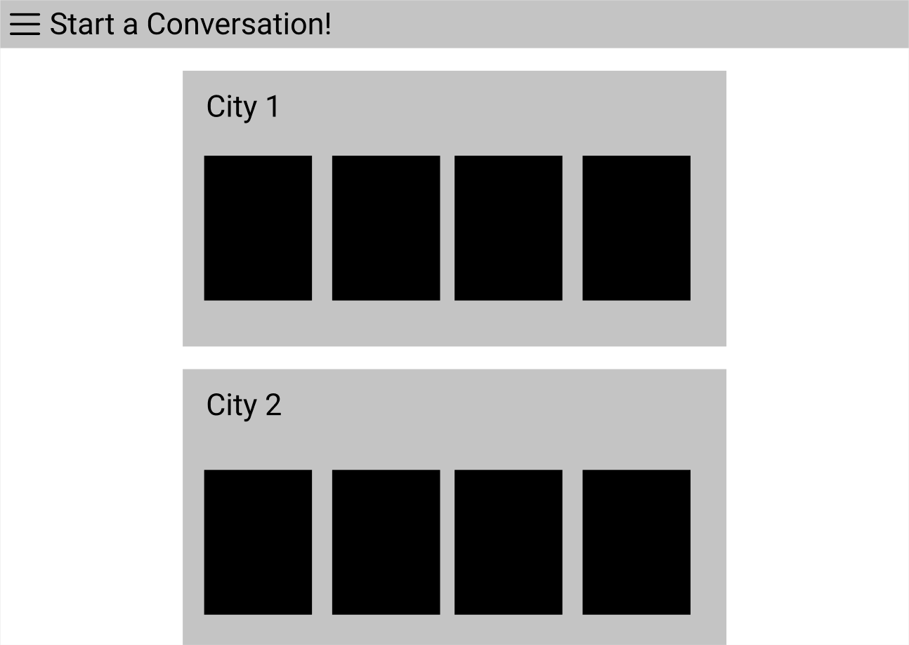

# Small Talk Generator
## Project Description
Have you every found the beginning of a meeting to be awkward and silent? No More! With the Small Talk Generator get access to all the things happening around the world where your team is located. Want to talk about the weekend? Look at the weather and events for you and your team all in one place. Small Talk Generator will present to you a dashboard of widgets tailored to topics you and your team find interesting. Pull it up at the beginning of a meeting and take a break from "Zoom Fatigue"!
## User Story

>**AS A(N)** team member 
I **WANT** a dashboard to display suggestive topics of conversation 
**SO THAT** I feel less awkward at the beginning of a video call

>**AS A(N)** team member 
I **WANT** to filter the suggestive topics 
**SO THAT** I only see topics that I am comfortable talking about

>**AS A(N)** team member 
I **WANT** get data from a variety of APIs 
**SO THAT** I have access to a number of different topics
- Business news
- Twitter
- Instagram
- Sports
- Weather
- Time / Time Zone
- Music / Groups
- Events
- Books
- Food
- Politics

## Wireframe or Sketch of the design

## APIS to be used
The below list of APIs are ones we are thinking might be helpful to create suggestive topics:
- [News API](https://www.programmableweb.com/api/news)
- [Washington Post](https://www.programmableweb.com/api/washington-post-trove-rest-api)
- [Twitter](https://www.programmableweb.com/api/twitter)
- [Social Media](https://www.programmableweb.com/api/hashedtags)
- [Eventbrite](https://www.programmableweb.com/api/eventbrite)
- [Weather](https://openweathermap.org/api/one-call-api)
- [Reddit](https://www.reddit.com/dev/api)
- [Sports](https://sportradar.us/sports-data/)
- [Bitcoin](https://bitcoincharts.com/about/markets-api/)
- [Politics](https://www.programmableweb.com/category/politics/api)
- [Restaurants]()
## Rough breakdown of tasks

[Small Talk Kanban Board](https://github.com/avidrunner87/small-talk/projects/2)
